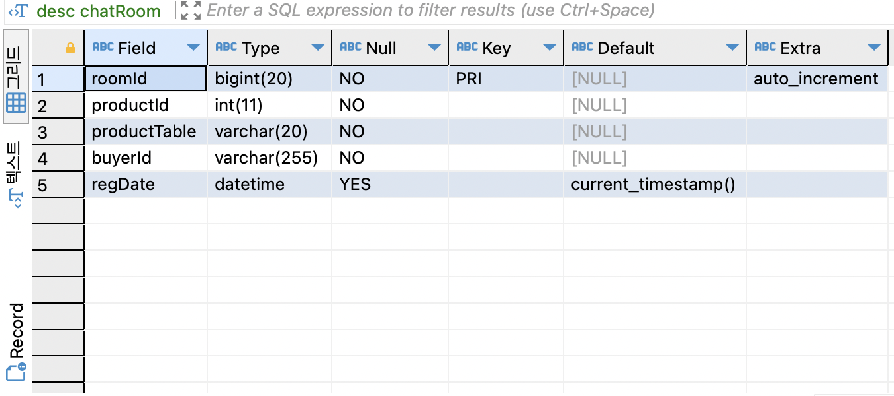
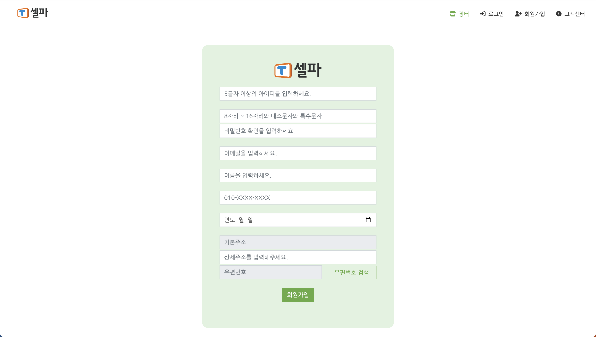
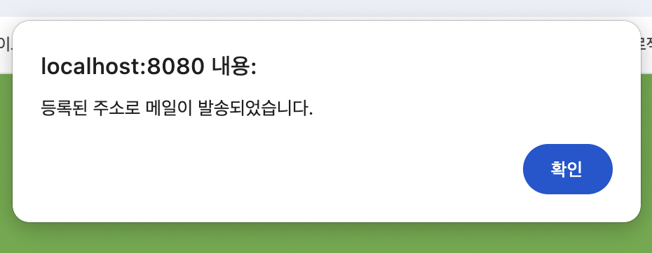

## 📍Chunjae Project 05
천재교육 풀스택 JAVA 과정 2기 5차 개인 프로젝트 _Tsherpa 홈페이지
  

## 🖥️ 프로젝트 : TSHERPA (2023.11.03 - 2023.11.17)

온라인 중고거래 플랫폼

 

  

### ⚙️ 개발 환경

 

 

 

 

  

## ⚒프로젝트 설계

### 📂DATABASE - 테이블 ERD

  

### 📂DATABASE - 테이블 구현
#### ROLE

#### USER

#### MARKET

#### CHATROOM

#### CHATLIST

#### MAINPHOTO

#### PHOTOS

#### LIKES

#### REPORT

#### FAQ

                    
#### NOTICE

                    
#### QNA

  

### 📂개념적 설계 (USECASE DIAGRAM)

  

### 📂CLASS DIAGRAM

  

### 📂시퀀스 다이어그램 (Sequence Diagram)

#### 관리자

#### 팝니다

  

# 📎기능 구현
## 🗂 메인 페이지
 

  

## 🗂 회원 기능
### 1. 로그인
- DB값 검증
- Spring Security 통한 로그인 인증 처리 및 권한 부여 구현
- 로그아웃
   

    

### 2. 회원가입
- 주소 API 연동
- ID 중복 체크
- 비밀번호 유효성 검사
   
  

    
 
  
### 3. 아이디 찾기
- 고객의 이메일, 전화번호 정보를 통한 아이디 존재 유무 검사
- 앞의 3자리만 보이도록 익명 처리
   
  

   
  

    

### 4. 비밀번호 찾기
- 네이버 메일 연동
- 가입한 이메일로 임시 비밀번호 발급
- 발급된 비밀번호 암호화 되어 DB에 저장
  
 

   
 

   
 

  

### 5. 마이페이지
- 본인이 작성한 판매글, 신고내역, 찜 목록 확인 가능
- 회원정보 수정
- 비밀번호 수정
 
 

 
 

 
 

   
## 🗂 장터 기능
### 1. 팝니다
- 비회원 : 열람 가능
- 회원 : 글쓰기/ 채팅 / 신고 / 찜하기 가능
- 네이버 지도 API 적용하여 상세주소 구현
   
 

  
 

    
  

### 2. 채팅
- stomp.js / socket.js 활용하여 구현
- 1 대 1 채팅 
- DB에 채팅 내용 실시간 반영
   
   

    
    

    

## 🗂 신고/ 찜하기 기능
- 회원만 신고 및 찜하기 가능
- 신고 : 이미 신고한 회원 중복 신고 방지
- AJAX 활용하여 찜하기 기능 구현
   
      

 

 

    

## 🗂 Q & A
### 1. 비로그인 및 회원 로그인 시
- 비로그인 시 Q & A 목록만 확인 가능하도록 구현
- 회원 로그인 시 질문글만 작성 가능
- 질문글을 작성한 사용자만 글 수정, 삭제 가능
   
  

   

    
  
### 2. 관리자 로그인 시
- 관리자 로그인 시 전체 게시글 CRUD 가능하도록 구현
- 관리자 페이지에서 미답변 질문 글 목록을 확인 후 바로 답변할 수 있도록 구현
   

    

 

    
  
## 🗂 공지사항
- 관리자만 공지사항 글 쓰기, 수정, 삭제 가능하도록 구현
- 회원은 공지사항 글 상세 보기만 가능하도록 구현
   
    

    

## 🗂 FAQ
- FAQ 글 목록 화면 및 기능 구현
   
      

    
  

## 🗂 관리자페이지
- 회원관리
- 커뮤니티 관리 : 공지사항 CRUD / 미답변 질문글 답변하기
- AJAX를 활요하여 신고된 회원 상태 변경
- 신고된 글 삭제 가능 
    

     
        

         
        

      

